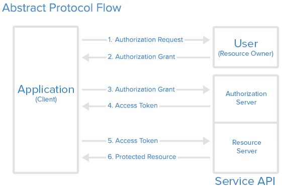

# Oauth2


## Why?

Modern Authentication and Authorization requires

* Sharing among multiple services
* Service to service communication
* User level SSO
* Partial resource access


## How to meet these requirements?


## What is oauth2

OAuth 2 is an authorization protocol that enables applications to obtain limited access to a service on an identified user's behalf. It works by delegating user authentication to the service that hosts the user account, and authorizing third-party applications to access the user account.


## Parties involved in OAuth2

1. Resource Owner
2. Client
3. Resource Server
4. Authorization Server


## How they interact

A *Client* application wants to access a resource owned by a *Resource Owner*. For this, the *owner* should approve the *client* in the *Authorization Server* to access the resource from *Resource Server*


## Abstract Protocol Flow



## Oauth2 Flows

1. Authorization Code
2. Implicit
3. Resource Owner Password Credentials
4. Client Credentials


## Authorization Code Flow

Request for code

```
https://auth.server/oauth/authorize?response_type=code \
  &client_id=**CLIENT_ID** \
  &redirect_uri=**CALLBACK_URL** \
    &scope=**read**
```

Receive code

```
https://client.app/callback?code=**AUTHORIZATION_CODE**
```


### Access Token

Get access token

```
https://auth.server/oauth/token?client_id=**CLIENT_ID** \
  &client_secret=** CLIENT_SECRET** \
  &grant_type=authorization_code \
  &code=**AUTHORIZATION_CODE** \
  &redirect_uri=**CALLBACK_URL**
```

<small>Server-side code obtains access token from auth server</small>


### Which oauth2 flow to use

<!--  -->
* Who needs access to a shared resource?
* How is the shared resource accessed?
* Access token required across session?
* Etc.

https://auth0.com/docs/api-auth/which-oauth-flow-to-use


# How does the Resource Server **verify** the access token?